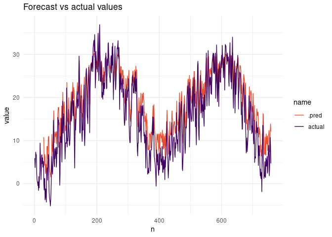

<!-- README.md is generated from README.Rmd. Please edit that file -->

# torchts 

<!-- badges: start -->

[](https://CRAN.R-project.org/package=torchts)
[](https://github.com/krzjoa/torchts/actions)
[](https://codecov.io/gh/krzjoa/torchts?branch=master)
[](https://www.redbubble.com/i/sticker/torchts-R-package-hex-sticker-by-krzjoa/93537989.EJUG5)

<!-- badges: end -->

> Time series models with torch

[](https://www.buymeacoffee.com/kjoachimiak)

## Installation

You can install the released version of torchts from
[CRAN](https://CRAN.R-project.org) with:

The development version from [GitHub](https://github.com/) with:

``` r
# install.packages("devtools")
devtools::install_github("krzjoa/torchts")
```

## parsnip models

``` r
library(torchts)
library(torch)
library(rsample)
library(dplyr, warn.conflicts = FALSE)
library(parsnip)
library(timetk)
library(ggplot2)

tarnow_temp <- 
  weather_pl %>% 
  filter(station == "TRN") %>% 
  select(date, tmax_daily)

# Params
EPOCHS    <- 3
HORIZON   <- 1
TIMESTEPS <- 28

# Splitting on training and test
data_split <- 
  time_series_split(
    tarnow_temp, date, 
    initial = "18 years",
    assess  = "2 years", 
    lag     = TIMESTEPS
  )

# Training 
rnn_model <- 
  rnn(
    timesteps    = TIMESTEPS,
    horizon      = HORIZON,
    epochs       = EPOCHS,
    learn_rate   = 0.01,
    hidden_units = 20,
    batch_size   = 32,
    scale        = TRUE 
  ) %>% 
  set_device('cpu')  %>% 
  fit(tmax_daily ~ date, 
      data = training(data_split))
#> Warning: Engine set to `torchts`.
#> 
#> Training started
#>  | train: 0.37756
#>  | train: 0.30164
#>  | train: 0.28896

prediction <-
  rnn_model %>%
  predict(new_data = testing(data_split))

plot_forecast(
  data     = testing(data_split),
  forecast = prediction,
  outcome  = tmax_daily
)
#> Warning: Removed 28 row(s) containing missing values (geom_path).
```



## Transforming data.frames to tensors

In `as_tensor` function we can specify columns, that are used to create
a tensor out of the input `data.frame`. Listed column names are only
used to determine dimension sizes - they are removed after that and are
not present in the final tensor.

``` r
temperature_pl <- 
  weather_pl %>% 
  select(station, date, tmax_daily)

# Expected shape
c(
  n_distinct(temperature_pl$station),
  n_distinct(temperature_pl$date),
  1
)
#> [1]    2 7305    1

temperature_tensor <- 
  temperature_pl %>% 
  as_tensor(station, date)

dim(temperature_tensor)
#> [1]    2 7305    1
temperature_tensor[1, 1:10]
#> torch_tensor
#> -0.2000
#> -1.4000
#>  0.4000
#>  1.0000
#>  0.6000
#>  3.0000
#>  4.0000
#>  1.0000
#>  1.2000
#>  1.4000
#> [ CPUFloatType{10,1} ]

temperature_pl %>% 
  filter(station == "SWK") %>% 
  arrange(date) %>% 
  head(10)
#>      station       date tmax_daily
#> 1140     SWK 2001-01-01       -0.2
#> 1230     SWK 2001-01-02       -1.4
#> 2330     SWK 2001-01-03        0.4
#> 2630     SWK 2001-01-04        1.0
#> 2730     SWK 2001-01-05        0.6
#> 2830     SWK 2001-01-06        3.0
#> 2930     SWK 2001-01-07        4.0
#> 3030     SWK 2001-01-08        1.0
#> 3130     SWK 2001-01-09        1.2
#> 2140     SWK 2001-01-10        1.4
```

## Similar projects in Python

-   [PyTorch
    Forecasting](https://pytorch-forecasting.readthedocs.io/en/stable/)
-   [PyTorchTS](https://github.com/zalandoresearch/pytorch-ts)
-   [TorchTS](https://rose-stl-lab.github.io/torchTS/)
-   [GluonTS](https://ts.gluon.ai/)
